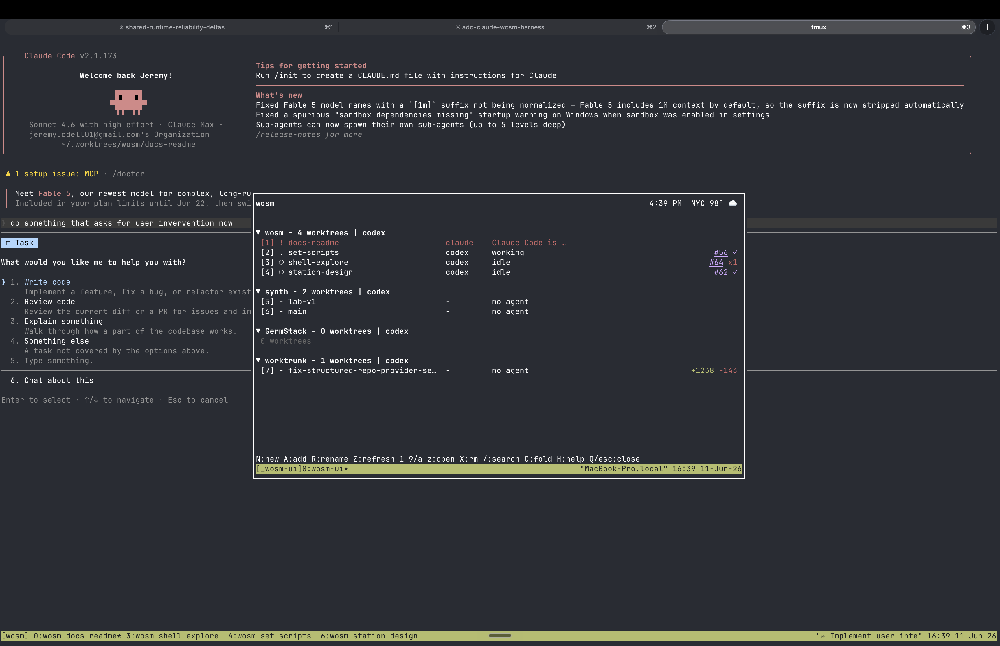
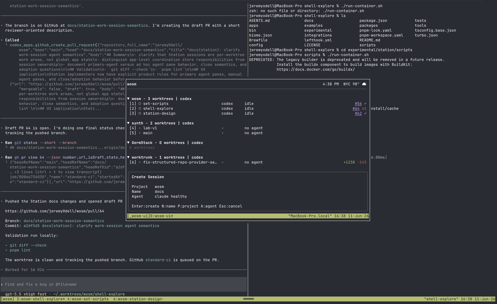

# wosm

**A local, terminal-native control plane for AI-agent worktree sessions.**

When you run more than one AI agent at a time, things get messy fast: worktrees multiply, tmux panes lose their names, you forget which branch has the agent that's been running for twenty minutes. wosm solves this. It keeps your projects, worktrees, terminal workspaces, and agent harnesses connected — and shows you the live picture in a single TUI.



---

## What it does

wosm tracks the runtime state of your local agent workflow and makes it visible:

- **Live TUI** — see every project, worktree, and agent session at a glance, updated in real time
- **Observer** — a local background process that owns runtime truth, reconciles Worktrunk state, and serves snapshots over a local socket
- **CLI** — `wosm doctor`, `wosm reconcile`, `wosm snapshot`, `wosm debug bundle`, and more
- **Session creation** — start a new agent session from the TUI with project, branch, and harness already wired up
- **Hook ingress** — Claude Code, Codex, Cursor, Pi, and OpenCode emit structured events that wosm receives and records
- **Diagnostics** — trace IDs, debug bundles, bounded log retention, and provider health checks built in from day one



---

## Getting started

**Requirements:** Node.js 24.x, pnpm 11. External tools (Worktrunk `wt`, tmux, agent CLIs) are optional and checked by `wosm doctor`.

```sh
# Install dependencies and build
pnpm install
pnpm build

# Run the smoke suite to verify the build
pnpm smoke:release

# Guided setup: writes a config, enables hooks, installs the tmux popup binding
pnpm wosm setup

# Check everything is wired up
pnpm wosm doctor
```

After setup, reconcile your projects and launch the TUI:

```sh
pnpm wosm reconcile --reason manual
pnpm wosm
```

To use bare `wosm` from any directory, link the CLI globally:

```sh
pnpm wosm:link
wosm doctor
```

### Config

`wosm setup` writes a first config for you. To edit it manually or start from the annotated example:

```sh
mkdir -p ~/.config/wosm
cp examples/config.toml ~/.config/wosm/config.toml
# edit project roots, then:
wosm doctor
```

See [examples/config.toml](examples/config.toml) for the full reference — projects, observer tuning, harness defaults, tmux topology, and hook setup.

---

## How it works

The repo is a pnpm workspace with three local apps and a set of shared packages.

**`@wosm/observer`** — the local background process. It talks to configured providers (Worktrunk, tmux, agent harnesses), reconciles project state, records bounded diagnostic evidence, and serves snapshots and events over a Unix socket. Everything else asks the observer questions; nothing else invents runtime state.

**`@wosm/cli`** — the `wosm` command. Setup, reconciliation, snapshots, live event observation, hooks, diagnostics, and TUI launch. Use `pnpm wosm <cmd>` during development.

**`@wosm/tui`** — the terminal UI. Connects to the observer, refreshes from live events and snapshots, and shows a provider-neutral view of projects, worktrees, sessions, terminal targets, and agent status. Launch with `wosm` (no subcommand).

**`@wosm/provider-hooks`** — the `wosm-ingress` sender used by generated hook commands. Delivers compact provider reports to the observer socket with bounded delivery and local spooling when the observer is unavailable.

---

## Integrations

wosm is built around provider boundaries. External tools stay in their own lane; wosm checks and reports their availability rather than bundling them.

| Provider | Role |
|----------|------|
| **Worktrunk** (`wt`) | Worktree backend — canonical branch and worktree state |
| **tmux** | Terminal workspaces, pane/window identity, popup binding |
| **Claude Code** | Harness provider — hook ingress, session tracking |
| **Codex** | Harness provider — hook ingress, session tracking |
| **Cursor** | Harness provider — hook ingress, session tracking |
| **Pi** | Harness provider — in-process hook reports |
| **OpenCode** | Harness provider — hook ingress, session tracking |

---

## Development

```sh
pnpm build              # build all packages
pnpm typecheck          # type-check all packages
pnpm lint               # biome + source-order checks
pnpm test:unit          # unit tests
pnpm test:contracts     # contract tests
pnpm test:integration   # integration tests
pnpm test:diagnostics   # diagnostics tests
pnpm test:agent:scripted  # scripted-agent lane (no real harness needed)
pnpm test:all           # full gate: build + typecheck + lint + all test suites
```

---

## Status

wosm is under active development. The current build supports local setup, diagnostics, Worktrunk reconciliation, JSON snapshots, hook ingestion, debug bundles, and the TUI. It is ready for local daily use; interfaces may still change.

---

## Documentation

| Doc | What it covers |
|-----|---------------|
| [Install](docs/install.md) | Full checkout setup, smoke options, local CLI linking |
| [Architecture](docs/architecture.md) | Authoritative boundary map for architecture decisions |
| [Development](docs/development.md) | Environment, test gates, data-shape conventions |
| [TUI](docs/tui.md) | React/Ink coding, terminal layout, test expectations |
| [Debugging](docs/debugging.md) | Trace IDs, command IDs, no-action debugging, evidence lookup |
| [Diagnostics](docs/diagnostics.md) | `wosm doctor`, debug bundles, log retention, hook setup |
| [System dependencies](docs/system-dependencies.md) | External tools, install checks, dependency diagnostics |
| [Manual smoke testing](docs/manual-smoke.md) | Runnable CLI/TUI smoke loops, real provider lanes |
| [Known issues](docs/known-issues.md) | Accepted limitations for the current local-use checkpoint |
| [Docs index](docs/README.md) | Full index including active plans and historical records |
